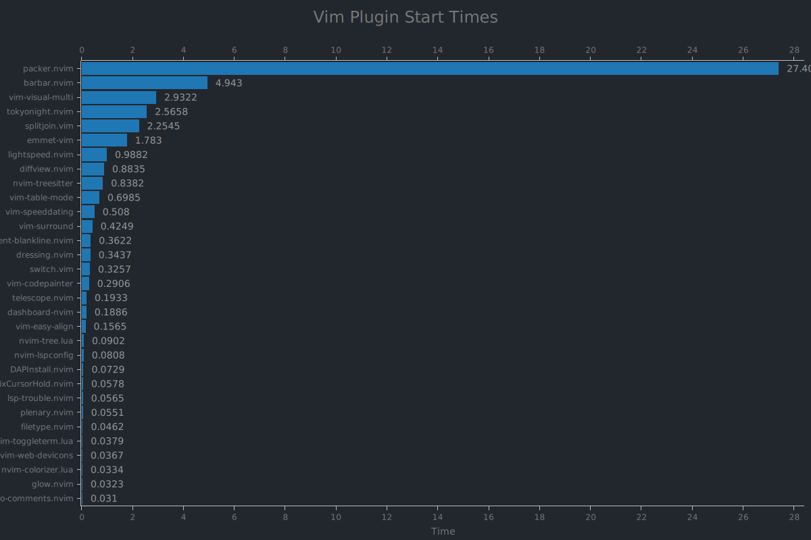

# Ecovim: Ultimate React Neovim Config

[](https://github.com/ecosse3/nvim/commits/master)


### A non-minimal Neovim config built to work most efficiently with React, JavaScript & TypeScript frameworks.

## Screenshots


## Installation

Make sure to use newest Neovim version (0.6) or even nightly.
Copy it into your terminal:

```bash
bash <(curl -s https://raw.githubusercontent.com/ecosse3/nvim/master/.install/run.sh)
```

After install configuration:

1. Treesitter Languages are not installed by default.\
Make sure to run `:TSInstall <lang>` or `:TSInstall maintained` after first run.
2. LSP servers are disabled by default. Please enable them in `lua/lsp/config.lua` by uncomment specific lines.

## Configuration

To change Ecovim related config use the `config.lua` file.\
To change vim settings use the `settings.lua` file.

## Keybindings

Currently I have no idea how to write for you my whole workflow of using Ecovim config in React.js projects I am working on,\
but I can write you the most useful custom key bindings by the frequency I use them.

Space (SPC) is my Leader key.

<details>
<summary>Searching</summary>

### Searching

| Key Bindings | Description                 |
|--------------|-----------------------------|
| <C - p>      | Telescope git files         |
| <S - p>      | Telescope live grep         |
| s            | Enables lightspeed forward  |
| S            | Enables lightspeed backward |
| SPC s d      | Search dotfiles             |
| SPC s h      | Search file history         |
| SPC s s      | Search history              |

</details>

<details>
<summary>Working with LSP</summary>

### Working with LSP:

| Key Bindings           | Description                                       |
|------------------------|---------------------------------------------------|
| <C - Space> or SPC c a | Code action                                       |
| <S - K>                | Show documentation under cursor                   |
| gd                     | Go to definition                                  |
| gr                     | Go to references                                  |
| ]g                     | Go to next diagnostic                             |
| [g                     | Go to prev diagnostic                             |
| SPC c f                | Format document (usually ESLint/Prettier)         |
| SPC c r                | Rename                                            |
| SPC c q                | Quick fix - when I exactly know if it will fix it |
| SPC c d                | Local diagnostics list                            |
| SPC c o                | Organize imports                                  |

</details>

<details>
<summary>Working with Git</summary>

### Working with Git:

| Key Bindings | Description                                                                                                                              |
|--------------|------------------------------------------------------------------------------------------------------------------------------------------|
| SPC g g      | Lazygit - for commiting and branch change                                                                                                |
| SPC g s      | Telescope status - when I want to change/search file I am working on with git changes                                                    |
| ]c           | Go to next change hunk                                                                                                                   |
| [c           | Go to prev change hunk                                                                                                                   |
| SPC g d      | Advanced powerful diff view with many filters for debugging code, checking previous changes etc.                                         |
| SPC g m      | View hunk diff of a line under cursor                                                                                                    |
| SPC g h r    | Reset changed hunk under cursor - I like to check quickly what I have changed in that line and then just type 'u' to go back             |
| SPC g h s    | Stage hunk under cursor - Sometimes it's faster than selecting lines in Lazygit, so I can stage specific lines and then just do a commit |
| SPC g l c    | Quick check of previous commit in current buffer, <C-s> inside to switch preview                                                         |

</details>

<details>
<summary>Working with Project</summary>

### Working with Project:

| Key Bindings | Description                                                                                                                                                                                                                                                                             |
|--------------|-----------------------------------------------------------------------------------------------------------------------------------------------------------------------------------------------------------------------------------------------------------------------------------------|
| <C - e>      | Toggles nvim-tree file explorer                                                                                                                                                                                                                                                         |
| SPC p w      | Find word under cursor in project - very useful to find where component is used. Just use binding and type '<'. There is a lot of alternatives like lsp_references but I like it with telescope and to not find only references but whole text under cursor.                            |
| SPC p f      | Find file under cursor in project - it finds files in project which contains text under cursor. Useful when you name directories by component name in React and wants to go quickly to file. 'gd' is better but in some projects without TS or with mixed JS/TS it cannot work properly |
| SPC p t      | Finds TODOs/NOTES in project                                                                                                                                                                                                                                                            |
| SPC p l      | Switch between projects                                                                                                                                                                                                                                                                 |
| SPC p s      | Save session to load it later from Dashboard                                                                                                                                                                                                                                            |

</details>

<details>
<summary>Commenting</summary>

### Commenting

| Key Bindings | Description                |
|--------------|----------------------------|
| gcc          | Create/remove comment      |
| gc (visual)  | Create/remove comment      |
| gcO          | Create comment line before |
| gco          | Create comment line after  |

</details>

<details>
<summary>Table Mode / Alignment</summary>

### Table Mode / Alignment

| Key Bindings | Description                                                                       |
|--------------|-----------------------------------------------------------------------------------|
| ga (visual)  | Aligns selection based on separator (comma, semi-colon, colon etc.)               |
| SPC t m      | Enables Table Mode. Do it in markdown file with some table and you will see magic |
| SPC t i C    | (Only when Table Mode Enabled) Insert column before                               |
| SPC t i c    | (Only when Table Mode Enabled) Insert column after                                |
| SPC t d c    | (Only when Table Mode Enabled) Delete column                                      |
| SPC t d r    | (Only when Table Mode Enabled) Delete row                                         |
| SPC t s      | (Only when Table Mode Enabled) Sort table alphabetically                          |

</details>

<details>
<summary>Other</summary>

### Other VERY useful bindings

| Key Bindings    | Description                                                                                                                                          |
|-----------------|------------------------------------------------------------------------------------------------------------------------------------------------------|
| <S - q>         | Smartly closes current buffer without breaking UI                                                                                                    |
| <C - a>         | It is not only increases number, but switches between true/false/const/let/function/arrow function/increment dates etc.                              |
| <C - n>         | Finds next occurence (like *) of word and puts multi-cursor there. Then you can go to Insert mode, Append, Change or Delete.                         |
| <C - o>         | Jumps to previous cursor in jumplist. I use it very often.                                                                                           |
| <C - i>         | Jumps to next cursor in jumplist.                                                                                                                    |
| <C - u>         | Uppercase word under cursor.                                                                                                                         |
| v <ENTER>       | Smartly selects next subjects of current treesitter context                                                                                          |
| za              | Toggle folds. By treesitter they are automatically added to TS/JS files in smart way                                                                 |
| zM              | Close all folds                                                                                                                                      |
| zR              | Open all folds                                                                                                                                       |
| gJ              | Smartly joins lines based on treesitter                                                                                                              |
| gS              | Smartly splits lines based on treesitter. I do if VERY often when I want to put import element to new lines (e.g. import { A, B, C, D, E } from ...) |
| < F12 >         | Opens/closes split terminal                                                                                                                          |

</details>

More coming soon...
Check out the which-key menu and keybindings.lua for most used maps.


## Performance

Measured on Manjaro Linux.



<details>

| Plugin                | Max   | Min   | Median | Average | Deviation |
|-----------------------|-------|-------|--------|---------|-----------|
| packer.nvim           | 29.17 | 26.34 | 27.06  | 27.400  | 0.82865   |
| barbar.nvim           | 5.396 | 4.632 | 4.833  | 4.9430  | 0.24331   |
| vim-visual-multi      | 4.845 | 2.618 | 2.684  | 2.9322  | 0.64473   |
| tokyonight.nvim       | 2.985 | 2.337 | 2.516  | 2.5658  | 0.17981   |
| splitjoin.vim         | 2.814 | 1.927 | 2.208  | 2.2545  | 0.22991   |
| emmet-vim             | 1.891 | 1.691 | 1.778  | 1.7830  | 0.04796   |
| lightspeed.nvim       | 1.124 | 0.923 | 0.973  | 0.9882  | 0.05839   |
| diffview.nvim         | 1.201 | 0.781 | 0.853  | 0.8835  | 0.11407   |
| nvim-treesitter       | 0.946 | 0.749 | 0.824  | 0.8382  | 0.06759   |
| vim-table-mode        | 1.103 | 0.612 | 0.659  | 0.6985  | 0.13677   |
| vim-speeddating       | 0.620 | 0.472 | 0.487  | 0.5080  | 0.04537   |
| vim-surround          | 0.682 | 0.380 | 0.392  | 0.4249  | 0.08735   |
| indent-blankline.nvim | 0.453 | 0.310 | 0.360  | 0.3622  | 0.03858   |
| dressing.nvim         | 0.449 | 0.307 | 0.326  | 0.3437  | 0.04207   |
| switch.vim            | 0.352 | 0.311 | 0.320  | 0.3257  | 0.01351   |
| telescope.nvim        | 0.241 | 0.175 | 0.191  | 0.1933  | 0.01936   |
| dashboard-nvim        | 0.229 | 0.168 | 0.177  | 0.1886  | 0.02268   |
| vim-easy-align        | 0.195 | 0.147 | 0.151  | 0.1565  | 0.01378   |
| nvim-tree.lua         | 0.130 | 0.062 | 0.092  | 0.0902  | 0.02328   |
| nvim-lspconfig        | 0.190 | 0.067 | 0.068  | 0.0808  | 0.03643   |
| DAPInstall.nvim       | 0.082 | 0.069 | 0.072  | 0.0729  | 0.00365   |
| FixCursorHold.nvim    | 0.065 | 0.054 | 0.056  | 0.0578  | 0.00322   |
| lsp-trouble.nvim      | 0.059 | 0.054 | 0.057  | 0.0565  | 0.00163   |
| plenary.nvim          | 0.068 | 0.047 | 0.050  | 0.0551  | 0.00857   |
| filetype.nvim         | 0.063 | 0.041 | 0.042  | 0.0462  | 0.00820   |
| nvim-toggleterm.lua   | 0.053 | 0.035 | 0.036  | 0.0379  | 0.00511   |
| nvim-web-devicons     | 0.040 | 0.035 | 0.036  | 0.0367  | 0.00149   |
| nvim-colorizer.lua    | 0.035 | 0.031 | 0.034  | 0.0334  | 0.00150   |
| glow.nvim             | 0.040 | 0.029 | 0.031  | 0.0323  | 0.00287   |
| todo-comments.nvim    | 0.043 | 0.027 | 0.030  | 0.0310  | 0.00431   |

</details>

Ecovim started in 177.538ms

## Todo

| Description                                          | Progress                                                           |
|------------------------------------------------------|--------------------------------------------------------------------|
| Provide dependencies and recommendations             |  |
| Add uninstaller script                               |  |
| Support for nvim-dap debugger for React              |  |
| Better support for null-ls and local formatting      |  |
| Better support to project word refactor              |  |
| Auto resize for more consistent UI behavior          |  |
| Reload in-time support                               |  |
| Support more LSPs                                    |  |
| Project Logo                                         |  |
| Better UI customization when nvim 0.8 will be in dev |  |

<details>
<summary>Done</summary>

| Description                                  | Progress                                                           |
|----------------------------------------------|--------------------------------------------------------------------|
| Support ESLint & Prettier in Native LSP      |      |
| Replace coc-explorer with nvim-tree.lua      |      |
| Replace coc.nvim with Native LSP             |      |
| Change fzf.nvim to telescope.nvim            |      |
| Update statusline to support LSP diagnostics |      |
| Rewrite most config to lua                   |      |
| Support TailwindCSS with colors              |      |
| Provide current screenshots                  |      |
| Create shell installer for Linux & macOS     |      |

</details>
