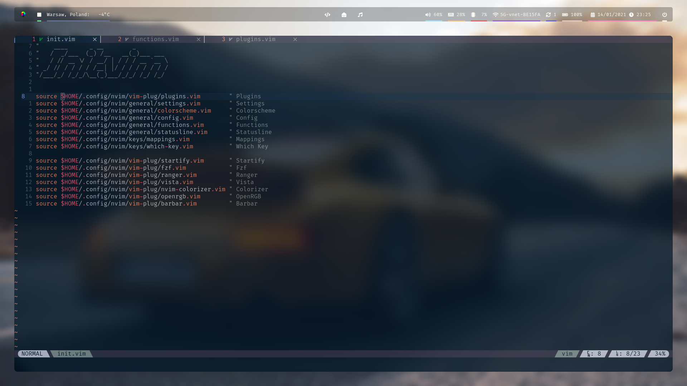
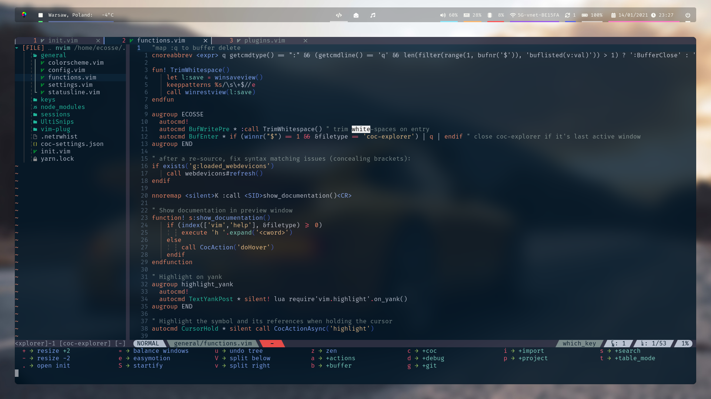

# Ultimate React Neovim Config

## Screenshots

New screenshots soon!

## Todo

| Description                             | Progress                                                           |
|-----------------------------------------|--------------------------------------------------------------------|
| Rewrite most config to lua              |                 |
| Replace coc-explorer with nvim-tree.lua |  |
| Replace coc.nvim with Native LSP        |  |
| Change fzf.nvim to telescope.nvim       |      |

