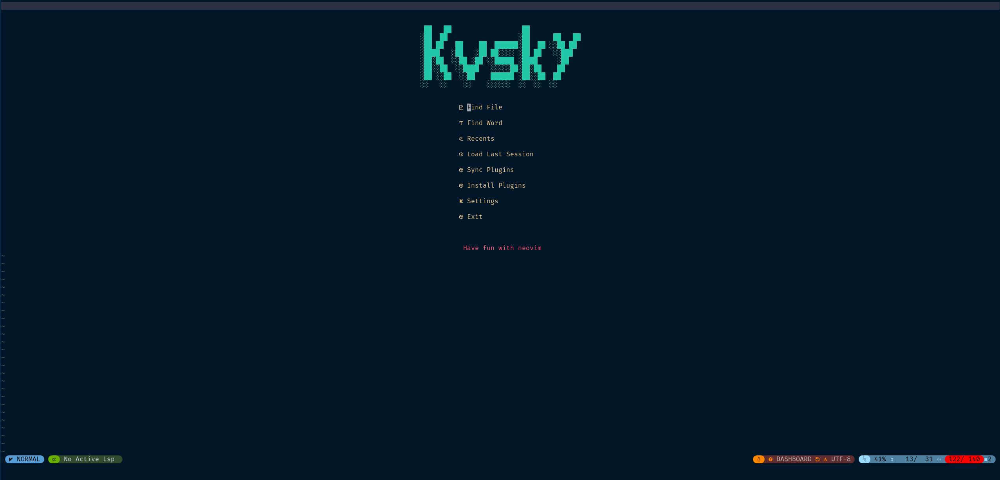
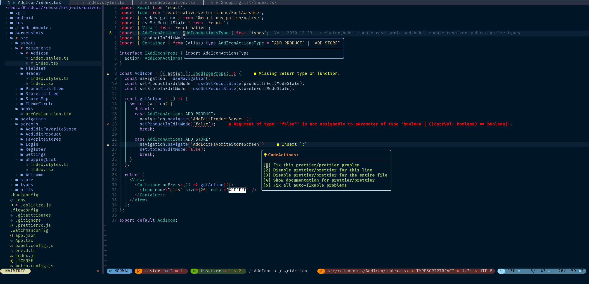

# Ecovim: Ultimate React Neovim Config

## Screenshots

## Configuration

To change Ecovim related config use the `config.lua` file.
To change vim settings use the `settings.lua` file.

## Performance

Measured on Manjaro Linux.

| Module                           | Total (ms) | Load time (ms) |
|----------------------------------|------------|----------------|
| nightfly.vim                     | 052.1      | 001.532        |
| fix_cursorhold_nvim.vim          | 064.55     | 000.054        |
| bufferline.vim                   | 069.33     | 004.682        |
| dashboard.vim                    | 069.67     | 000.201        |
| diffview.vim                     | 070.86     | 001.084        |
| emmet.vim                        | 072.67     | 001.705        |
| filetype.nvim                    | 072.80     | 000.020        |
| galaxyline.vim                   | 073.04     | 000.147        |
| glow.lua                         | 073.20     | 000.031        |
| indent_blankline.vim             | 073.82     | 000.519        |
| lightspeed.vim                   | 074.99     | 001.057        |
| trouble.vim                      | 075.18     | 000.082        |
| lspsaga.vim                      | 075.45     | 000.145        |
| colorizer.vim                    | 075.62     | 000.033        |
| nvim-gps.vim                     | 077.13     | 001.424        |
| nvim-lsp-installer.vim           | 077.33     | 000.093        |
| lspconfig.vim                    | 077.51     | 000.073        |
| toggleterm.vim                   | 077.66     | 000.035        |
| nvim-tree.lua                    | 077.84     | 000.061        |
| nvim-treesitter.vim              | 078.47     | 000.557        |
| rainbow.vim                      | 078.71     | 000.140        |
| nvim-web-devicons.vim            | 078.85     | 000.033        |
| ts_context_commentstring.vim     | 108.5      | 000.100        |
| nvim-treesitter-textobjects.vim  | 109.97     | 000.651        |
| nvim-treesitter-textsubjects.vim | 110.8      | 000.218        |
| packer.nvim                      | 111.0      | 032.088        |
| plenary.vim                      | 111.1      | 000.044        |
| splitjoin.vim                    | 113.4      | 002.174        |
| switch.vim                       | 113.8      | 000.297        |
| telescope.vim                    | 114.1      | 000.134        |
| todo-comments.nvim               | 114.310    | 000.028        |
| codepainter.vim                  | 114.724    | 000.297        |
| easy_align.vim                   | 114.966    | 000.146        |
| vimsnippets.vim                  | 115.144    | 000.031        |
| speeddating.vim                  | 115.715    | 000.483        |
| surround.vim                     | 116.206    | 000.378        |
| table-mode.vim                   | 116.954    | 000.636        |
| visual-multi.vim                 | 119.744    | 002.680        |
| cmp_nvim_ultisnips.lua           | 121.151    | 000.920        |
| which-key.nvim                   | 126.094    | 000.021        |
| dashboard.vim                    | 151.122    | 000.483        |

Ecovim started in 177.538ms

## Todo

| Description                                  | Progress                                                           |
|----------------------------------------------|--------------------------------------------------------------------|
| Create shell installer for Linux & macOS     |                 |
| Support for nvim-dap debugger for React      |                 |
| Find way to refactor words like in coc       |  |
| List all plugins I use in README             |  |
| Support ESLint & Prettier in Native LSP      |      |
| Replace coc-explorer with nvim-tree.lua      |      |
| Replace coc.nvim with Native LSP             |      |
| Change fzf.nvim to telescope.nvim            |      |
| Update statusline to support LSP diagnostics |      |
| Rewrite most config to lua                   |      |
| Support TailwindCSS with colors              |      |
| Provide current screenshots                  |      |

