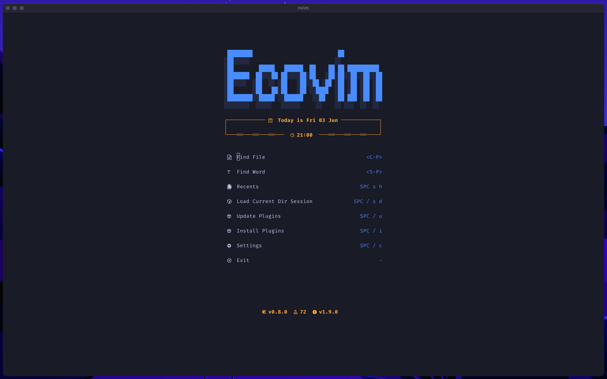
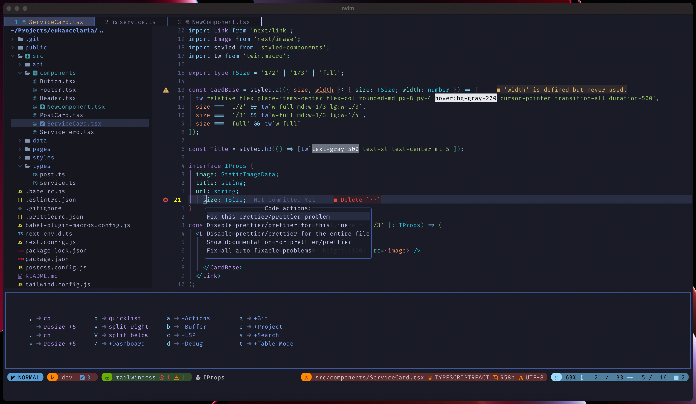
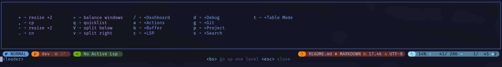
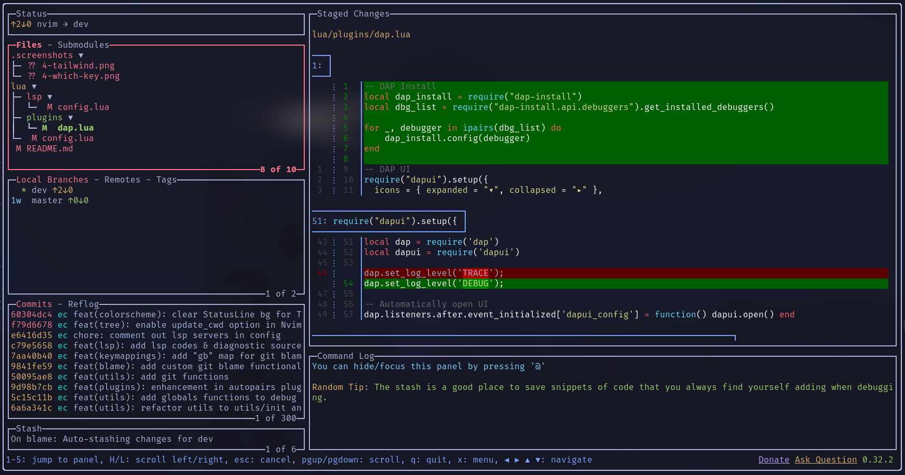
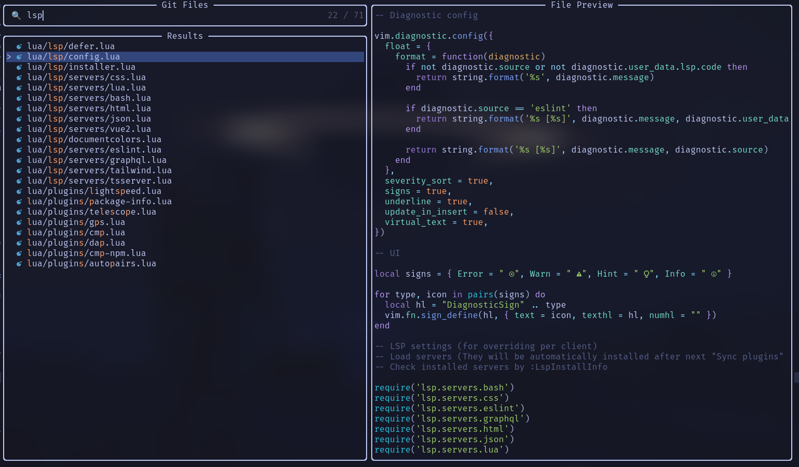
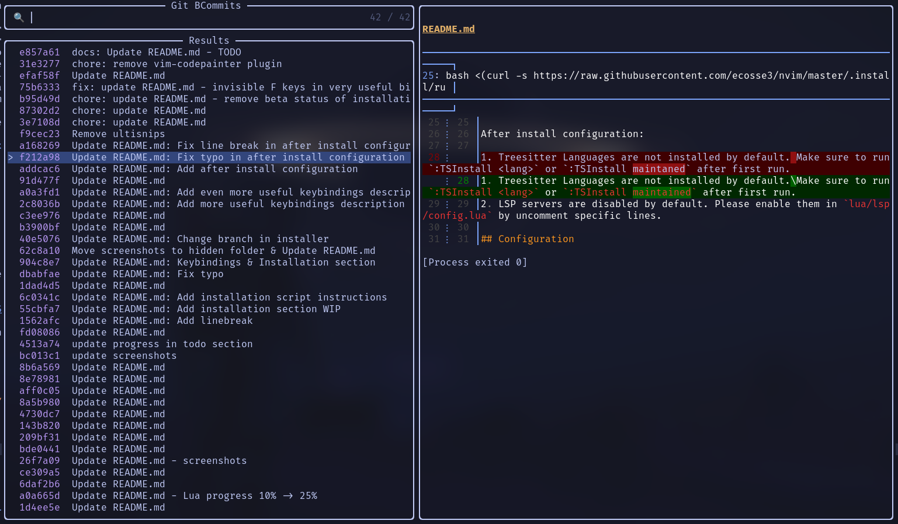
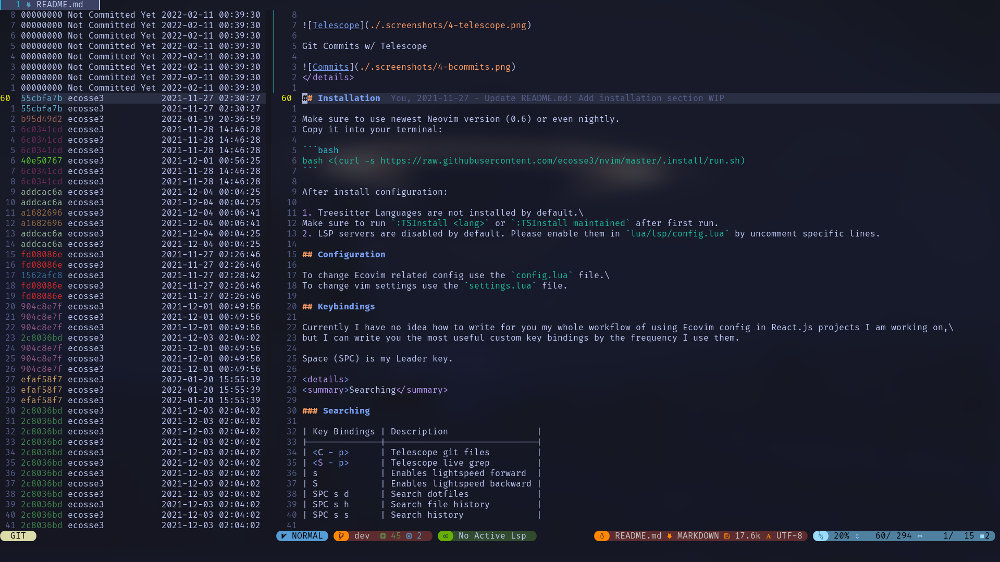

# Ecovim: Frontend Neovim Config

### A non-minimal Neovim config built to work most efficiently with Frontend Development.

## Features

- Configured for TypeScript Development (React.js, Next.js, Vue.js, Angular, Node.js etc.)
- Great default theme: [Tokyonight](https://github.com/folke/tokyonight.nvim)
- Lazy loaded via [lazy.nvim](https://github.com/folke/lazy.nvim)
- Highly performant (90ms load time)
- Extendable LSP configuration via [mason.nvim](https://github.com/williamboman/mason.nvim)
- Support for :robot: AI: [ChatGPT](https://openai.com/blog/chatgpt/), [GitHub Copilot](https://github.com/features/copilot), [Codeium](https://codeium.com/) and [Tabnine](https://www.tabnine.com/)
- Support for [TailwindCSS](https://tailwindcss.com/) with highlighted colors
- JSON autocompletion for most popular Frontend configs
- NPM packages autocompletion in _package.json_
- Internal [Jest](https://github.com/facebook/jest) testing and [Coverage](https://github.com/andythigpen/nvim-coverage) support
- Debugging with [nvim-dap](https://github.com/mfussenegger/nvim-dap) (works with React.js & React Native)
- Automatic Treesitter-based folding with imports folded by default
- Current code context via [nvim-navic](https://github.com/SmiteshP/nvim-navic)
- Beautiful and functional custom statusline built with [galaxyline.nvim](https://github.com/glepnir/galaxyline.nvim) 
- Git management with [Lazygit](https://github.com/jesseduffield/lazygit), custom telescope commits view with [git-delta](https://github.com/dandavison/delta), [gitsigns](https://github.com/lewis6991/gitsigns.nvim) & [diffview](https://github.com/sindrets/diffview.nvim), custom git blame

And of course usage of [telescope](https://github.com/nvim-telescope/telescope.nvim), [nvim-tree](https://github.com/kyazdani42/nvim-tree.lua), [barbar](https://github.com/romgrk/barbar.nvim), [cmp](https://github.com/hrsh7th/nvim-cmp), [treesitter](https://github.com/nvim-treesitter/nvim-treesitter), [blankline](https://github.com/lukas-reineke/indent-blankline.nvim) & more!

## Screenshots

Dashboard

Overview

More screenshots

Some of screenshots can be old

TailwindCSS with nvim-cmp

Which Key Menu

Lazygit

Telescope

Git Commits w/ Telescope

Git Side Blame

## Installation

**Just clone GitHub repo into ~/.config/nvim.**

**Prerequisities**

- Make sure you have installed the latest version of Neovim v0.9.0+ (nightly is preferred).
- Have wget, curl, unzip, git, make, pip, python, npm, node, luarocks, fd, ripgrep and cargo installed on your system. You can check if you are missing anything with `:checkhealth` command.
- Have any nerd font installed. *Fira Code* has been used in screenshots. You can download it from [nerdfonts.com](https://www.nerdfonts.com/font-downloads).

**After install configuration:**

1. Selected treesitter Languages are installed by default.
To check it run `:TSInstallInfo`.
Make sure to run `:TSInstall <lang>` for specific language you want to install.
2. LSP servers are enabled by default. You can check installed LSP servers by `:Mason` command.

## Configuration

To change EcoVim related config use the `config/EcoVim.lua` file.

To change vim settings use the `config/options.lua` file.

To change plugin related settings use the specific `plugins/[name].lua` file. Some of the plugin config can be set up during plugin installation in `config/plugins.lua` file, where you can add new plugins.

## Keybindings

Currently I have no idea how to write for you my whole workflow of using Ecovim config in React.js projects I am working on,\
but I can write you the most useful custom key bindings by the frequency I use them.

Space (SPC) is my Leader key.

File Explorer

### File Explorer

| Key Bindings | Description                                   |
|--------------|-----------------------------------------------|
| <C - e>      | Open File Explorer                            |
| Backspace    | Back to file explorer (in editor normal mode) |
| g?           | Open commands menu                            |
| a            | Create new file/directory                     |
| x            | Cut                                           |
| c            | Copy                                          |
| y            | Copy name                                     |
| r            | Rename                                        |
| I            | Toggle git ignore files                       |

Searching

### Searching

| Key Bindings | Description         |
|--------------|---------------------|
| <C - p>      | Telescope git files |
| <S - p>      | Telescope live grep |
| s            | Enables lightspeed  |
| SPC s d      | Search dotfiles     |
| SPC s h      | Search file history |
| SPC s s      | Search history      |

Working with LSP

### Working with LSP:

| Key Bindings           | Description                                       |
|------------------------|---------------------------------------------------|
| <C - Space> or SPC c a | Code action                                       |
| <S - K>                | Show documentation under cursor                   |
| gd                     | Go to definition                                  |
| gr                     | Go to references                                  |
| ]g                     | Go to next diagnostic                             |
| [g                     | Go to prev diagnostic                             |
| SPC c f                | Format document (usually ESLint/Prettier)         |
| SPC c r                | Rename                                            |
| SPC c q                | Quick fix - when I exactly know if it will fix it |
| SPC c d                | Local diagnostics list                            |
| SPC c o                | Organize imports                                  |

Working with Git

### Working with Git:

| Key Bindings | Description                                                                                                                              |
|--------------|------------------------------------------------------------------------------------------------------------------------------------------|
| SPC g g      | Lazygit - for committing and branch change                                                                                               |
| SPC g s      | Telescope status - when I want to change/search file I am working on with git changes                                                    |
| ]c           | Go to next change hunk                                                                                                                   |
| [c           | Go to prev change hunk                                                                                                                   |
| SPC g d      | Advanced powerful diff view with many filters for debugging code, checking previous changes etc.                                         |
| SPC g m      | View hunk diff of a line under cursor                                                                                                    |
| SPC g h r    | Reset changed hunk under cursor - I like to check quickly what I have changed in that line and then just type 'u' to go back             |
| SPC g h s    | Stage hunk under cursor - Sometimes it's faster than selecting lines in Lazygit, so I can stage specific lines and then just do a commit |
| SPC g l c    | Quick check of previous commit in current buffer, <C-s> inside to switch preview                                                         |
| SPC g w c    | Creates a new worktree. Recommended directory is `../path`                                                                               |
| SPC g w w    | Switches to a worktree. <C-d> removes worktree.                                                                                          |

Working with Project

### Working with Project:

| Key Bindings | Description                                                                                                                                                                                                                                                                             |
|--------------|-----------------------------------------------------------------------------------------------------------------------------------------------------------------------------------------------------------------------------------------------------------------------------------------|
| <C - e>      | Toggles nvim-tree file explorer                                                                                                                                                                                                                                                         |
| SPC p w      | Find word under cursor in project - very useful to find where component is used. Just use binding and type '<'. There is a lot of alternatives like LSP references but I like it with telescope and to not find only references but whole text under cursor.                            |
| SPC p f      | Find file under cursor in project - it finds files in project which contains text under cursor. Useful when you name directories by component name in React and wants to go quickly to file. 'gd' is better but in some projects without TS or with mixed JS/TS it cannot work properly |
| SPC p t      | Finds TODOs/NOTES in project                                                                                                                                                                                                                                                            |
| SPC p l      | Switch between projects                                                                                                                                                                                                                                                                 |
| SPC p s      | Save session to load it later from Dashboard                                                                                                                                                                                                                                            |

Commenting

### Commenting

| Key Bindings | Description                |
|--------------|----------------------------|
| gcc          | Create/remove comment      |
| gc (visual)  | Create/remove comment      |
| gcO          | Create comment line before |
| gco          | Create comment line after  |

Table Mode / Alignment

### Table Mode / Alignment

| Key Bindings | Description                                                                       |
|--------------|-----------------------------------------------------------------------------------|
| ga (visual)  | Aligns selection based on separator (comma, semi-colon, colon etc.)               |
| SPC t m      | Enables Table Mode. Do it in markdown file with some table and you will see magic |
| SPC t i C    | (Only when Table Mode Enabled) Insert column before                               |
| SPC t i c    | (Only when Table Mode Enabled) Insert column after                                |
| SPC t d c    | (Only when Table Mode Enabled) Delete column                                      |
| SPC t d r    | (Only when Table Mode Enabled) Delete row                                         |
| SPC t s      | (Only when Table Mode Enabled) Sort table alphabetically                          |

Other

### Other VERY useful bindings

| Key Bindings | Description                                                                                                                                                                               |
|--------------|-------------------------------------------------------------------------------------------------------------------------------------------------------------------------------------------|
| <S - q>      | Smartly closes current buffer without breaking UI                                                                                                                                         |
| <C - a>      | It is not only increases number, but switches between true/false/const/let/function/arrow function/increment dates etc.                                                                   |
| <C - n>      | Finds next occurrence (like *) of word and puts multi-cursor there. Then you can go to Insert mode, Append, Change or Delete. [Read more](https://github.com/mg979/vim-visual-multi/wiki) |
| <C - o>      | Jumps to previous cursor in jumplist. I use it very often.                                                                                                                                |
| v <ENTER>    | Smartly selects next subjects of current treesitter context                                                                                                                               |
| s            | Standalone jump to any word with `folke/flash.nvim`                                                                                                                                       |
| ciq          | Change inside ANY quotes (`` or '' or "" etc.) with `mini.ai`                                                                                                                             |
| cib          | Change inside ANY brackets ({} or [] or () etc.) with `mini.ai`                                                                                                                           |
| za           | Toggle folds. By LSP and nvim-ufo they are automatically added to supported files in smart way.                                                                                           |
| zM           | Close all folds                                                                                                                                                                           |
| zR           | Open all folds                                                                                                                                                                            |
| zr           | Open all folds except imports/comments                                                                                                                                                    |
| gJ           | Smartly joins lines based on treesitter                                                                                                                                                   |
| gS           | Smartly splits lines based on treesitter. I do if VERY often when I want to put import element to new lines (e.g. import { A, B, C, D, E } from ...)                                      |
| < F12 >      | Opens/closes terminal                                                                                                                                                                     |
| ~            | Switch function arguments smartly                                                                                                                                                         |

Check out the which-key menu and [keymappings.lua](https://github.com/ecosse3/nvim/blob/master/lua/config/keymappings.lua) for most used maps. 

## Performance

Measured on M1.

Ecovim started in 91.13ms 

## Future Todo 

| Description                                                          | Progress                                                           |
|----------------------------------------------------------------------|--------------------------------------------------------------------|
| Support more LSPs (not only frontend? - already possible via Mason)  |                  |
| Better configuration of additional LSPs (already possible via Mason) |                  |
| Project Logo                                                         |  |
| Auto resize for more consistent UI behavior                          |  |
| Reload in-time support                                               |  |

Done

| Description                                     | Progress                                                       |
|-------------------------------------------------|----------------------------------------------------------------|
| lazy.nvim instead of packer                     |  |
| Better support for null-ls and local formatting |  |
| Better support to project word refactor         |  |
| Support for nvim-dap debugger for React         |  |
| Support ESLint & Prettier in Native LSP         |  |
| Replace coc-explorer with nvim-tree.lua         |  |
| Replace coc.nvim with Native LSP                |  |
| Change fzf.nvim to telescope.nvim               |  |
| Update statusline to support LSP diagnostics    |  |
| Rewrite most config to lua                      |  |
| Support TailwindCSS with colors                 |  |
| Provide current screenshots                     |  |
| Create shell installer for Linux & MacOS        |  |

