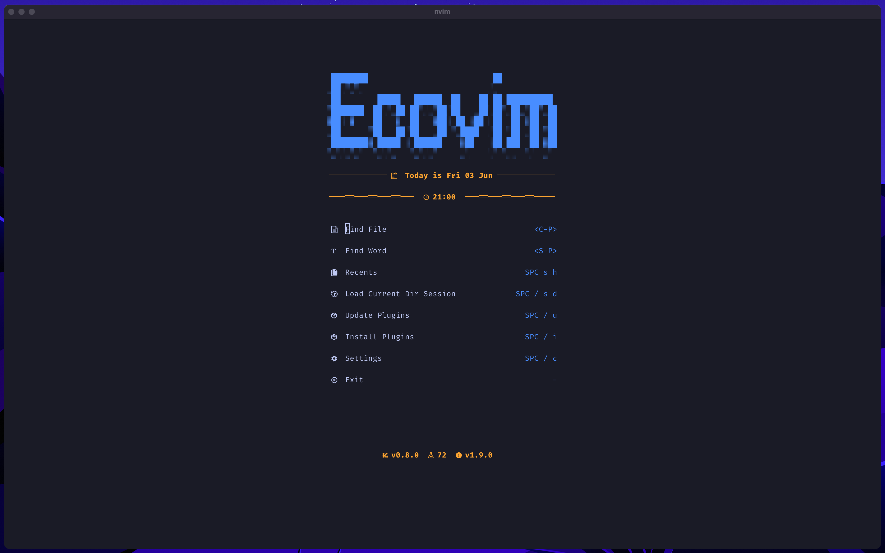
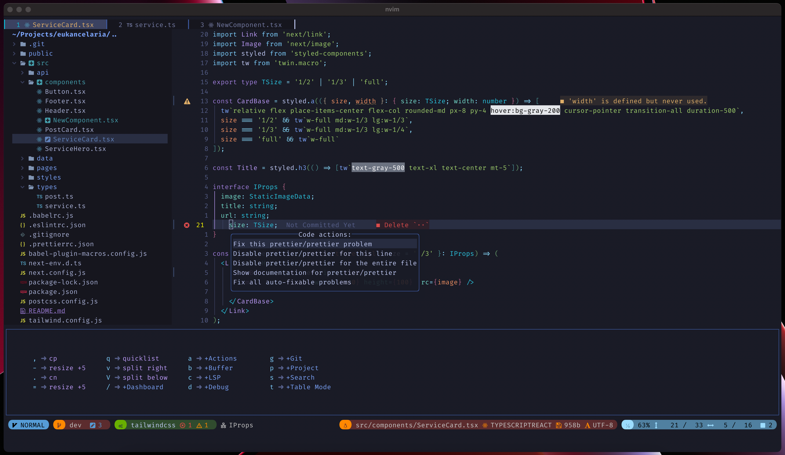
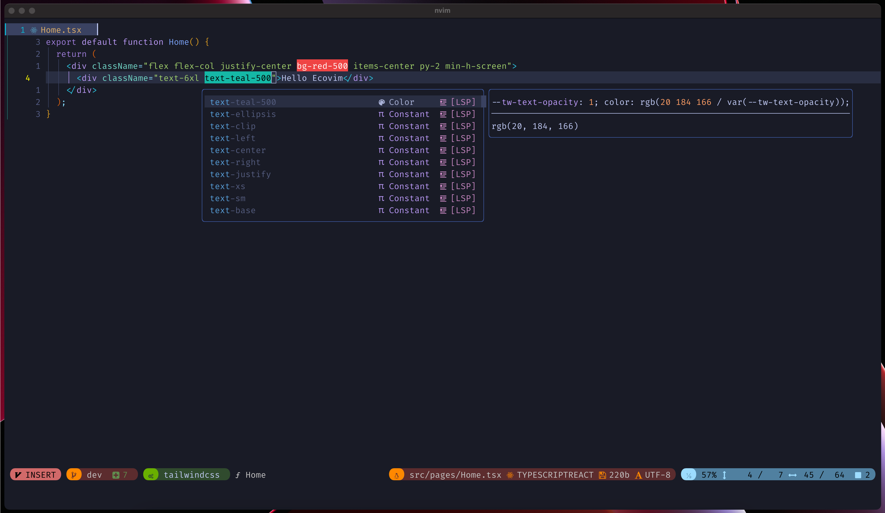
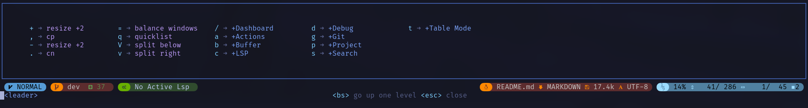
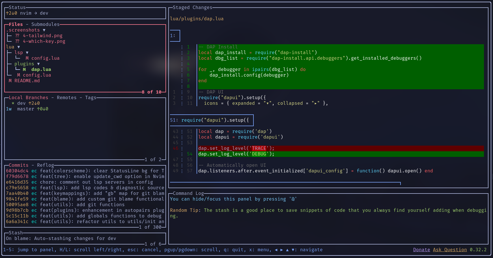
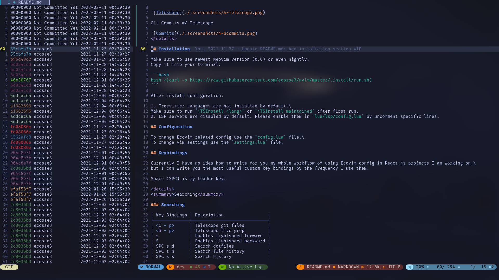

# Ecovim: Frontend Neovim Config

[](https://github.com/ecosse3/nvim/commits/master)


### A non-minimal Neovim config built to work most efficiently with Frontend Development.

## ✨ Features

<table>
<tr>
<td valign="top" width="33%">

### 🤖 AI & Assistance
- [Avante](https://github.com/yetone/avante.nvim) - Claude-powered coding agent
- [GitHub Copilot](https://github.com/features/copilot) - AI pair programmer
- [Copilot NES](https://github.com/github/copilot.vim) - Next Edit Suggestions
- [Opencode](https://github.com/sudo-tee/opencode.nvim) - OpenAI integration
- [MCPHub](https://github.com/ravitemer/mcphub.nvim) - Model Context Protocol

</td>
<td valign="top" width="33%">

### 🎨 UI & Experience
- [Tokyonight](https://github.com/folke/tokyonight.nvim) theme
- Custom [galaxyline](https://github.com/glepnir/galaxyline.nvim) statusline
- [Snacks.nvim](https://github.com/folke/snacks.nvim) - explorer, picker, notifications
- [tiny-glimmer](https://github.com/rachartier/tiny-glimmer.nvim) - highlight animations
- [tiny-inline-diagnostic](https://github.com/rachartier/tiny-inline-diagnostic.nvim) - enhanced diagnostics
- [todo-comments](https://github.com/folke/todo-comments.nvim) - TODO highlighting
- [which-key](https://github.com/folke/which-key.nvim) - keybinding helper

</td>
<td valign="top" width="33%">

### 💻 Frontend Development
- TypeScript, React, Next.js, Vue
- [TailwindCSS](https://tailwindcss.com/) with color highlighting
- [blink.cmp](https://github.com/Saghen/blink.cmp) - completion engine
- [boundary.nvim](https://github.com/Kenzo-Wada/boundary.nvim) - RSC `'use client'` markers
- NPM package info in package.json
- [Jest](https://github.com/facebook/jest) testing & coverage
- [treesj](https://github.com/Wansmer/treesj) - smart split/join lines

</td>
</tr>
<tr>
<td valign="top" width="33%">

### 🔧 DevOps & Tools
- Docker LSP support
- Terraform & HCL
- YAML language server
- [yazi.nvim](https://github.com/mikavilpas/yazi.nvim) - terminal file manager
- [harpoon](https://github.com/ThePrimeagen/harpoon) - quick file navigation
- [multicursor](https://github.com/jake-stewart/multicursor.nvim) - multi-cursor editing
- Monorepo-aware root detection (pnpm, Turborepo, Nx, Lerna, Rush)


</td>
<td valign="top" width="33%">

### 🔍 Code Quality
- Native LSP via [mason.nvim](https://github.com/williamboman/mason.nvim)
- [SchemaStore](https://github.com/b0o/SchemaStore.nvim) - 500+ JSON/YAML schemas
- [inc-rename](https://github.com/smjonas/inc-rename.nvim) - live-preview rename
- [symbol-usage](https://github.com/Wansmer/symbol-usage.nvim) - reference counts
- [lazydev](https://github.com/folke/lazydev.nvim) - Neovim Lua API completions
- [grug-far](https://github.com/MagicDuck/grug-far.nvim) - search & replace
- [text-case](https://github.com/johmsalas/text-case.nvim) - case conversion
- [scissors](https://github.com/chrisgrieser/nvim-scissors) - snippet editing

</td>
<td valign="top" width="33%">

### 🌳 Git Integration
- [Lazygit](https://github.com/jesseduffield/lazygit) terminal UI
- [gitsigns](https://github.com/lewis6991/gitsigns.nvim) - inline diffs
- [diffview](https://github.com/sindrets/diffview.nvim) - diff viewer
- [octo.nvim](https://github.com/pwntester/octo.nvim) - GitHub PRs & issues
- Custom git blame
- Side blame panel

</td>
</tr>
</table>

### 📘 TypeScript & React Features

EcoVim ships with deep TypeScript and React/Next.js integration out of the box:

| Feature | Plugin | Description |
|---------|--------|-------------|
| **Type checking** | [tsc.nvim](https://github.com/dmmulroy/tsc.nvim) | Async project-wide `tsc --noEmit` with quickfix |
| **Error translation** | [ts-error-translator](https://github.com/dmmulroy/ts-error-translator.nvim) | Human-readable TypeScript errors |
| **RSC boundaries** | [boundary.nvim](https://github.com/Kenzo-Wada/boundary.nvim) | Visualize `'use client'` directive usage in Next.js |
| **Template strings** | [template-string](https://github.com/axelvc/template-string.nvim) | Auto-convert to template literals on `${}` |
| **Tailwind values** | [tw-values](https://github.com/MaximilianLloyd/tw-values.nvim) | Preview resolved Tailwind class values |
| **Tailwind fold** | [tailwind-fold](https://github.com/razak17/tailwind-fold.nvim) | Fold long Tailwind class strings |
| **Smart increment** | [dial.nvim](https://github.com/monaqa/dial.nvim) | Cycle true/false, const/let, increment dates |
| **Reference counts** | [symbol-usage](https://github.com/Wansmer/symbol-usage.nvim) | Show usage counts above functions/components |
| **Live rename** | [inc-rename](https://github.com/smjonas/inc-rename.nvim) | Preview LSP rename as you type |
| **JSON/YAML schemas** | [SchemaStore](https://github.com/b0o/SchemaStore.nvim) | Auto-schemas for tsconfig, package.json, etc. |
| **Lua API completions** | [lazydev](https://github.com/folke/lazydev.nvim) | Neovim Lua API types for `vim.*`, plugins |

### 🚀 Performance
- **Startup time**: ~90ms (measured on M1 Mac)
- **Lazy loaded**: All plugins via [lazy.nvim](https://github.com/folke/lazy.nvim)

## Screenshots

Dashboard



Overview



<details>
<summary>More screenshots</summary>

Some of screenshots can be old

TailwindCSS with nvim-cmp



Which Key Menu



Lazygit



Git Side Blame


</details>

---

## ☕ Support

If you enjoy using EcoVim and would like to support its development:

[](https://github.com/sponsors/ecosse3)

Your support helps maintain and improve EcoVim. Thank you! 🙏

## Installation

**Just clone GitHub repo into ~/.config/nvim.**

**Prerequisities**

- Make sure you have installed the latest version of Neovim v0.11+ (nightly is preferred).
- Have wget, curl, unzip, git, make, pip, python, npm, node, luarocks, fd, ripgrep and cargo installed on your system. You can check if you are missing anything with `:checkhealth` command.
- Have any nerd font installed. *Fira Code* has been used in screenshots. You can download it from [nerdfonts.com](https://www.nerdfonts.com/font-downloads).

**After install configuration:**

1. Selected treesitter Languages are installed by default.
To check it run `:TSInstallInfo`.
Make sure to run `:TSInstall <lang>` for specific language you want to install.
2. LSP servers are enabled by default. You can check installed LSP servers by `:Mason` command.

## Configuration

All customization is done in `lua/config/user.lua`. This file is **gitignored** and won't cause merge conflicts when updating!

### Quick Start

```bash
# Copy the example file
cp lua/config/user.lua.example lua/config/user.lua

# Edit your personal config
nvim lua/config/user.lua
```

### Quick Customization Examples

```lua
-- lua/config/user.lua

-- Change colorscheme
EcoVim.colorscheme = "tokyonight-storm"

-- Add custom LSP servers
EcoVim.lsp.ensure_installed = { "rust_analyzer", "gopls" }

-- Override formatters
EcoVim.formatters = {
  javascript = { "prettierd" },
  typescript = { "prettierd" },
}

-- Disable default keymaps
EcoVim.keys.s = false  -- Disable flash.nvim 's' key

-- Add custom autocmds
EcoVim.autocmds.auto_save = {
  event = "FocusLost",
  pattern = "*",
  command = "silent! wa",
}

-- Override any plugin config (use repo name, e.g., "snacks.nvim")
EcoVim.plugin_overrides["snacks.nvim"] = function(_, opts)
  opts.picker.layout = "vertical"
end

-- Configure project directories (for <leader>pl project picker)
EcoVim.plugins.projects.dev = { "~/Projects", "~/Work" }

-- Rooter supports monorepo tools out of the box:
-- pnpm, Turborepo, Nx, Lerna, Rush
-- Add package.json back to rooter if you don't use monorepos
-- EcoVim.plugins.rooter.patterns = { ".git", "package.json" }

-- Toggle features on/off
EcoVim.lsp.format_on_save = true        -- Enable auto-format on save
EcoVim.lsp.inlay_hints = false           -- Disable inlay hints
EcoVim.plugins.completion.ghost_text = false  -- Disable ghost text
EcoVim.plugins.git.blame_line = false    -- Disable inline git blame

-- Custom vim options
vim.opt.tabstop = 4
vim.opt.shiftwidth = 4
```

### Full Configuration Options

| Option | Type | Default | Description |
|--------|------|---------|-------------|
| `colorscheme` | string | `"tokyonight-night"` | Theme name |
| `ui.font` | table | | GUI font settings |
| `ui.float.border` | string | `"rounded"` | Border style: "rounded", "single", "double", "shadow", "none" |
| `lsp.ensure_installed` | table | `{}` | Additional LSP servers to install via Mason |
| `lsp.exclude` | table | `{ "ts_ls", "copilot" }` | LSP servers to not auto-enable |
| `lsp.servers` | table | `{}` | Custom LSP server configurations |
| `lsp.format_on_save` | boolean | `false` | Auto-format on save (toggle at runtime with `:LspToggleAutoFormat`) |
| `lsp.inlay_hints` | boolean | `true` | Show inlay hints from LSP servers |
| `formatters` | table | `{}` | Override formatters per filetype |
| `linters` | table | `{}` | Override linters per filetype |
| `keys` | table | | Disable default keymaps: `keys.s = false` |
| `autocmds` | table | | Add custom autocmds |
| `plugin_overrides` | table | | Override any plugin configuration |
| `plugins.ai.*.enabled` | boolean | varies | Enable/disable AI plugins (avante, copilot, opencode) |
| `plugins.completion.select_first_on_enter` | boolean | `false` | Auto-select first completion item on Enter |
| `plugins.completion.ghost_text` | boolean | `true` | Show inline completion preview (ghost text) |
| `plugins.git.blame_line` | boolean | `true` | Show inline git blame on current line |
| `plugins.rooter.patterns` | table | | Root detection patterns for vim-rooter |
| `plugins.projects.dev` | table | `{ "~/Projects" }` | Directories to scan for projects |
| `plugins.projects.patterns` | table | `{ ".git" }` | Patterns to detect project roots |

### Tips

- **Runtime toggles** -- Some options also have runtime commands: `:LspToggleAutoFormat` for format-on-save, `:Gitsigns toggle_current_line_blame` for git blame.
- **Plugin overrides** let you change ANY plugin's config without forking files. Use the plugin's GitHub repo name (e.g., `"snacks.nvim"`, `"blink.cmp"`). Function overrides receive `(plugin, opts)` -- mutate `opts` directly, no need to return.
- **Monorepo users** -- EcoVim detects pnpm/Turborepo/Nx/Lerna/Rush roots automatically. The `package.json` is excluded from rooter patterns to prevent `cwd` from scoping to sub-packages.
- **Non-monorepo users** -- Add `package.json` back: `EcoVim.plugins.rooter.patterns = { ".git", "package.json" }`
- **Border style** -- `EcoVim.ui.float.border` controls ALL floating windows (hover, diagnostics, completion, signature help). Set it once and everything follows.
- See `user.lua.example` for the complete reference with all available options and inline documentation.

### Updating EcoVim

Since your config is in `user.lua` (gitignored), you can safely update:

```bash
cd ~/.config/nvim
git pull
```

No merge conflicts with your personal settings!

### For vim settings and new plugins

- Edit `config/options.lua` for vim options
- Create files in `lua/plugins/` for new plugins

## Keybindings

Space (SPC) is my Leader key.

> **Tip:** Press `SPC` in normal mode to open the which-key menu and explore all available keybindings interactively.

<details>
<summary>File Explorer (Snacks)</summary>

### File Explorer (Snacks)

| Key Bindings | Description                                |
|--------------|--------------------------------------------|
| `<C-e>`      | Toggle Snacks file explorer                |
| `<D-e>`      | Toggle Snacks file explorer (macOS Cmd+E)  |

The Snacks explorer uses its own keybindings when focused. Press `?` inside the explorer to see all available actions (create, rename, copy, delete, etc.).

</details>

<details>
<summary>Searching</summary>

### Searching

| Key Bindings | Description                        |
|--------------|------------------------------------|
| `<C-p>`      | Smart file finder (Snacks picker)  |
| `<S-p>`      | Live grep (Snacks picker)          |
| `s`          | Flash jump to any word             |
| `S`          | Flash treesitter selection         |
| `SPC s f`    | Find files                         |
| `SPC s b`    | Find buffers                       |
| `SPC s g`    | Git grep                           |
| `SPC s o`    | Grep open buffers                  |
| `SPC s h`    | Recent files                       |
| `SPC s H`    | Command history                    |
| `SPC s s`    | Search history                     |
| `SPC s q`    | Quickfix list                      |
| `SPC s c`    | Color schemes                      |
| `SPC s d`    | Search dotfiles (nvim config)      |
| `SPC s t`    | Search TODOs                       |
| `SPC s T`    | Search TODO/FIX/FIXME              |
| `]t`         | Next TODO comment                  |
| `[t`         | Previous TODO comment              |

</details>

<details>
<summary>Working with LSP</summary>

### Working with LSP

| Key Bindings           | Description                             |
|------------------------|-----------------------------------------|
| `gd`                   | Go to definition                        |
| `gr`                   | Go to references                        |
| `gy`                   | Go to type definition                   |
| `gi`                   | Go to implementation                    |
| `K`                    | Hover documentation / peek fold         |
| `L`                    | Signature help (normal & insert mode)   |
| `gl`                   | Line diagnostics                        |
| `]g`                   | Next diagnostic                         |
| `[g`                   | Previous diagnostic                     |
| `<C-Space>` / `SPC c a`| Code action                             |
| `SPC c f`              | Format document (LSP)                   |
| `SPC c r`              | Rename symbol (live preview)            |
| `SPC c R`              | Rename file                             |
| `SPC c d`              | Diagnostics list (Snacks picker)        |
| `SPC c t`              | Toggle format on save                   |
| `SPC c u`              | Toggle symbol usage                     |
| `SPC c m`              | Mason LSP manager                       |
| `SPC c l i`            | LSP Info                                |
| `SPC c l r`            | LSP Restart                             |
| `SPC c l s`            | LSP Stop                                |
| `SPC c l S`            | LSP Start                               |
| `SPC s s`              | Document symbols                        |
| `SPC s S`              | Workspace symbols                       |

</details>

<details>
<summary>TypeScript / React (buffer-local)</summary>

### TypeScript / React (buffer-local)

These keybindings are available in TypeScript/JavaScript buffers:

| Key Bindings | Description                          |
|--------------|--------------------------------------|
| `SPC c e`    | Workspace errors (TSC)               |
| `SPC c i`    | Add missing imports                  |
| `SPC c o`    | Organize imports                     |
| `SPC c s`    | Sort imports                         |
| `SPC c u`    | Remove unused imports                |
| `SPC c v`    | Show Tailwind CSS values             |
| `<C-a>`      | Smart increment (numbers, booleans, dates, const/let, &&/\|\|, etc.) |
| `<C-x>`      | Smart decrement                      |

</details>

<details>
<summary>Formatting & Linting</summary>

### Formatting & Linting

| Key Bindings       | Description                              |
|--------------------|------------------------------------------|
| `SPC f`            | Format file (conform.nvim)               |
| `SPC f` (visual)   | Format selection                         |
| `SPC l`            | Lint file (nvim-lint)                    |

</details>

<details>
<summary>Working with Git</summary>

### Working with Git

| Key Bindings | Description                                                             |
|--------------|-------------------------------------------------------------------------|
| `SPC g g`    | Lazygit                                                                 |
| `SPC g s`    | Git status (Snacks picker)                                              |
| `SPC g f`    | Git files (Snacks picker)                                               |
| `SPC g a`    | Git add current file                                                    |
| `SPC g A`    | Git add all                                                             |
| `SPC g b`    | Blame panel (git-blame)                                                 |
| `SPC g m`    | Blame line (full commit)                                                |
| `SPC g d`    | Diff file history (diffview)                                            |
| `SPC g D`    | Diff view open                                                          |
| `SPC g S`    | Diff view status                                                        |
| `SPC g i`    | GitHub issues list (Octo)                                               |
| `SPC g p`    | GitHub pull requests list (Octo)                                        |
| `SPC g L`    | Copy git URL for selection (gitlinker)                                  |
| `]c`         | Next change hunk                                                        |
| `[c`         | Previous change hunk                                                    |
| **Hunk actions** |                                                                     |
| `SPC g h s`  | Stage hunk                                                              |
| `SPC g h r`  | Reset hunk                                                              |
| `SPC g h S`  | Stage buffer                                                            |
| `SPC g h R`  | Reset buffer                                                            |
| `SPC g h u`  | Undo stage hunk                                                         |
| `SPC g h p`  | Preview hunk                                                            |
| `SPC g h d`  | Diff hunk                                                               |
| `SPC g h t`  | Toggle deleted                                                          |
| **Git log** |                                                                          |
| `SPC g l a`  | Lazygit log (cwd)                                                       |
| `SPC g l c`  | Lazygit current file history                                            |
| `SPC g l A`  | Git log (Snacks picker)                                                 |
| `SPC g l C`  | File commits (Snacks picker)                                            |

</details>

<details>
<summary>Working with Project</summary>

### Working with Project

| Key Bindings | Description                                           |
|--------------|-------------------------------------------------------|
| `SPC p w`    | Grep word under cursor in project (Snacks picker)     |
| `SPC p l`    | Switch between projects (Snacks picker)               |
| **Search & Replace (grug-far)** |                                      |
| `SPC p r r`  | Open search & replace                                 |
| `SPC p r a`  | Search & replace (ast-grep engine)                    |
| `SPC p r w`  | Search & replace word under cursor                    |
| `SPC p r W`  | Search & replace word under cursor in current file    |
| `SPC p r f`  | Search & replace in current file                      |
| **Sessions** |                                                       |
| `SPC p s s`  | Save current session                                  |
| `SPC p s l`  | Load session                                          |
| `SPC p s L`  | Load last session                                     |
| `SPC p s m`  | Session manager commands                              |

</details>

<details>
<summary>AI & Agents</summary>

### AI & Agents

| Key Bindings | Description                                  |
|--------------|----------------------------------------------|
| **Copilot NES** |                                           |
| `<Tab>`      | Accept/navigate Copilot NES suggestion       |
| **Avante** (when enabled) |                                  |
| `SPC a a`    | Toggle Avante sidebar                        |
| Uses Avante default keybindings — see `:h avante` for full list |  |
| **Opencode** (when enabled) |                                |
| `SPC o`      | Opencode group (see which-key)               |
| **MCPHub**   |                                              |
| `:MCPHub`    | Open MCP Hub                                 |

</details>

<details>
<summary>Debugging (DAP)</summary>

### Debugging (DAP)

| Key Bindings | Description                 |
|--------------|-----------------------------|
| `SPC d a`    | Continue                    |
| `SPC d d`    | Continue                    |
| `SPC d b`    | Toggle breakpoint           |
| `SPC d B`    | Conditional breakpoint      |
| `SPC d i`    | Step into                   |
| `SPC d o`    | Step out                    |
| `SPC d O`    | Step over                   |
| `SPC d h`    | Evaluate expression         |
| `SPC d t`    | Terminate                   |
| `SPC d u`    | Open DAP UI                 |
| `SPC d c`    | Close DAP UI                |
| `SPC d w`    | Float watches               |
| `SPC d s`    | Float scopes                |
| `SPC d r`    | Float REPL                  |

Pre-configured for Chrome, Node.js (pwa-node), Next.js server-side, Jest, Vitest, and Deno.

</details>

<details>
<summary>Testing (Jest / Neotest)</summary>

### Testing (Jest / Neotest)

Available in TypeScript/JavaScript buffers:

| Key Bindings | Description             |
|--------------|-------------------------|
| `SPC j j`    | Run nearest test        |
| `SPC j f`    | Run current file        |
| `SPC j l`    | Run last test           |
| `SPC j o`    | Open test output        |
| `SPC j i`    | Toggle info panel       |
| `SPC j s`    | Stop                    |

</details>

<details>
<summary>Harpoon</summary>

### Harpoon

| Key Bindings | Description              |
|--------------|--------------------------|
| `SPC H`      | Add file to Harpoon      |
| `SPC h`      | Open Harpoon menu        |
| `SPC 1-4`    | Jump to Harpoon file 1-4 |
| `SPC [`      | Previous Harpoon file    |
| `SPC ]`      | Next Harpoon file        |

</details>

<details>
<summary>Multi-cursor</summary>

### Multi-cursor

Using [jake-stewart/multicursor.nvim](https://github.com/jake-stewart/multicursor.nvim):

| Key Bindings    | Description                              |
|-----------------|------------------------------------------|
| `<Up>`          | Add cursor above                         |
| `<Down>`        | Add cursor below                         |
| `SPC m`         | Add cursor at next match of word         |
| `<Left>`        | Rotate to next cursor                    |
| `<Right>`       | Rotate to previous cursor                |
| `SPC x`         | Delete cursor                            |
| `<C-LeftMouse>` | Add/remove cursor with mouse             |
| `<C-q>`         | Toggle cursor                            |
| `<Esc>`         | Clear cursors (or enable if disabled)    |
| `SPC g v`       | Restore cursors                          |
| `SPC A`         | Align cursor columns                     |

</details>

<details>
<summary>Window & Split Management</summary>

### Window & Split Management

| Key Bindings          | Description                  |
|-----------------------|------------------------------|
| `SPC v`               | Split right                  |
| `SPC V`               | Split below                  |
| `<C-h/j/k/l>`        | Move between splits          |
| `<A-h/j/k/l>`        | Resize splits                |
| `SPC SPC h/j/k/l`    | Swap buffer between splits   |
| `SPC =`               | Resize +5                    |
| `SPC -`               | Resize -5                    |
| `<C-\>`              | Previous split               |

</details>

<details>
<summary>Commenting</summary>

### Commenting

| Key Bindings | Description                |
|--------------|----------------------------|
| `gcc`        | Toggle line comment        |
| `gbc`        | Toggle block comment       |
| `gc` (visual)| Toggle comment             |
| `gcO`        | Add comment line before    |
| `gco`        | Add comment line after     |
| `SPC a c`    | Comment box                |

</details>

<details>
<summary>Table Mode / Alignment</summary>

### Table Mode / Alignment

| Key Bindings | Description                                                                       |
|--------------|-----------------------------------------------------------------------------------|
| `ga` (visual)| Aligns selection based on separator (comma, semi-colon, colon etc.) via `mini.align` |
| `SPC t m`    | Toggle Table Mode (activates in markdown files via `vim-table-mode`)              |
| `SPC t i C`  | (Table Mode) Insert column before                                                 |
| `SPC t i c`  | (Table Mode) Insert column after                                                  |
| `SPC t d c`  | (Table Mode) Delete column                                                        |
| `SPC t d r`  | (Table Mode) Delete row                                                           |
| `SPC t s`    | (Table Mode) Sort table alphabetically                                            |

</details>

<details>
<summary>NPM Package Management</summary>

### NPM Package Management

Available in `package.json` buffers:

| Key Bindings | Description                |
|--------------|----------------------------|
| `SPC n s`    | Show package versions      |
| `SPC n h`    | Hide package versions      |
| `SPC n u`    | Update package             |
| `SPC n i`    | Install new package        |
| `SPC n d`    | Delete package             |
| `SPC n r`    | Reinstall dependencies     |
| `SPC n c`    | Change version             |

</details>

<details>
<summary>Zen Mode</summary>

### Zen Mode

| Key Bindings | Description     |
|--------------|-----------------|
| `SPC z`      | Zen mode        |
| `SPC Z`      | Zoom mode       |

</details>

<details>
<summary>Other Useful Bindings</summary>

### Other Useful Bindings

| Key Bindings       | Description                                                                      |
|--------------------|----------------------------------------------------------------------------------|
| `<S-q>`            | Smartly close current buffer without breaking UI                                 |
| `<D-s>`            | Save file (macOS Cmd+S)                                                          |
| `<D-q>` / `<D-w>`  | Close buffer (macOS Cmd+Q/W)                                                    |
| `<D-d>` / `<D-u>`  | Half-page scroll down/up (macOS Cmd+D/U)                                        |
| `<D-i>`            | Jump forward in jumplist (macOS Cmd+I)                                           |
| `<C-o>`            | Jump to previous position in jumplist                                            |
| `<Tab>` / `<S-Tab>` | Cycle through buffers                                                           |
| `<BS>`             | Jump to first non-blank character                                                |
| `H`                | Jump to first non-blank character                                                |
| `v <CR>`           | Smartly select next treesitter subject (repeat to expand)                        |
| `ciq`              | Change inside ANY quotes (`` or '' or "" etc.) via `mini.ai`                     |
| `cib`              | Change inside ANY brackets ({} or [] or () etc.) via `mini.ai`                   |
| `za`               | Toggle fold                                                                      |
| `zM`               | Close all folds                                                                  |
| `zR`               | Open all folds                                                                   |
| `zr`               | Open all folds except imports/comments                                           |
| `gJ`               | Smart join lines (treesitter-based via treesj)                                   |
| `~`                | Swap function arguments (treesitter)                                             |
| `gP`               | Print debug variable under cursor (printer.nvim)                                 |
| `<F12>`            | Toggle terminal                                                                  |
| `SPC q`            | Toggle quickfix list                                                             |
| `SPC ,` / `SPC .`  | Previous / next quickfix item                                                   |
| `SPC y`            | Open Yazi file manager                                                           |
| `SPC D`            | Open database (sqlit)                                                            |
| **Snippets** |                                                                                       |
| `SPC a s a`        | Add new snippet                                                                  |
| `SPC a s e`        | Edit snippet                                                                     |
| **EcoVim** |                                                                                         |
| `SPC / /`          | Open dashboard                                                                   |
| `SPC / c`          | Open config                                                                      |
| `SPC / i`          | Manage plugins (Lazy)                                                            |
| `SPC / u`          | Update plugins                                                                   |
| `SPC a n`          | Toggle line numbers                                                              |
| `SPC a r`          | Toggle relative numbers                                                          |
| **Treesitter textobjects** |                                                                          |
| `]]` / `[[`        | Next / previous JSX element                                                      |
| `]f` / `[f`        | Next / previous function start                                                   |
| `]m` / `[m`        | Next / previous class start                                                      |
| `af` / `if`        | Select around / inside function                                                  |
| `ac` / `ic`        | Select around / inside class                                                     |

</details>

Check out the which-key menu and [keymappings.lua](https://github.com/ecosse3/nvim/blob/master/lua/config/keymappings.lua) for most used maps.


## Performance

Measured on M1.

Ecovim started in 91.13ms 

<details>
<summary>Done</summary>

| Description                                     | Progress                                                       |
|-------------------------------------------------|----------------------------------------------------------------|
| lazy.nvim instead of packer                     |  |
| Better support for null-ls and local formatting |  |
| Better support to project word refactor         |  |
| Support for nvim-dap debugger for React         |  |
| Support ESLint & Prettier in Native LSP         |  |
| Replace coc.nvim with Native LSP                |  |
| Replace telescope.nvim with snacks.nvim picker  |  |
| Replace nvim-tree with snacks.nvim explorer     |  |
| Update statusline to support LSP diagnostics    |  |
| Rewrite most config to lua                      |  |
| Support TailwindCSS with colors                 |  |
| Provide current screenshots                     |  |
| Create shell installer for Linux & MacOS        |  |
| Better LSP configuration via EcoVim.lsp         |  |
| Custom formatters/linters via EcoVim config     |  |
| Plugin/keymap customization via EcoVim config   |  |

</details>
